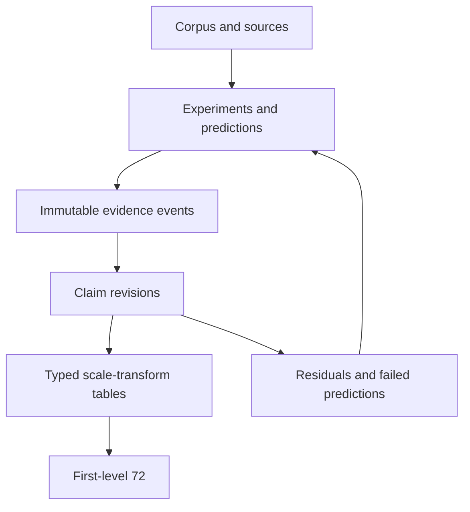

# AYLI — As You Like It

A traceable research repository for reconstructing a universal relational framework across historical systems, hierarchies, scale transformations, and symbolic carriers.

## Governing principle

This repository does not begin from a finished correspondence chart. It preserves the path by which claims were proposed, tested, promoted, downgraded, split, corrected, rejected, or left unresolved.

Every eventual member of the first-level 72 must be traceable through:

`72 member → transform → claim revision → evidence → experiment → prediction → prior state → source`

## Current state

This initial foundation contains:

- an explicit 65-branch corpus coverage register, including deep, focused, soft-touch, queued, control, and quarantined material;
- a source register with citation-completion flags;
- reconstructed immutable research events, clearly marked where exact timestamps are unavailable;
- experiment, prediction, evidence, claim-evolution, and residual ledgers;
- 36 separate typed transform tables;
- a provenance graph and data dictionary.

The first-level 72 is deliberately not frozen yet.

## Repository map

| Path | Purpose |
|---|---|
| `data/00_corpus_coverage.csv` | Everything covered, touched, controlled, queued, or quarantined |
| `data/01_sources.csv` | Source and transmission register |
| `data/02_research_events.csv` | Immutable chronology of research actions |
| `data/03_experiments.csv` | Experimental designs and blindness controls |
| `data/04_predictions.csv` | Predictions registered before tests |
| `data/05_evidence.csv` | Atomic observations |
| `data/06_claim_revisions.csv` | Append-only claim evolution |
| `data/07_residuals.csv` | Failures, unknowns, and unresolved predictions |
| `atlas/transform_index.csv` | Index of typed transforms |
| `atlas/transforms/` | One table per transform |
| `docs/` | Method and architecture |
| `graph/provenance.mmd` | Provenance DAG |
| `schemas/DATA_DICTIONARY.md` | Field semantics and invariants |

## Non-negotiable rules

1. Failed does not mean deleted.
2. Later evidence never overwrites the earlier belief state.
3. Shared ancestry is not independent confirmation.
4. Arithmetic inevitability receives no novelty vote.
5. Equal cardinality does not imply equal type, function, topology, or ancestry.
6. Soft-touch and queued branches remain represented without being presented as completed.
7. Every source locator marked pending must be completed before publication-grade claims are made.
